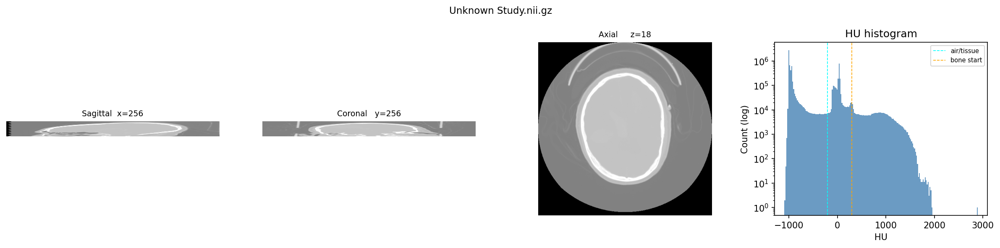

# CT Volume Basics — Understanding the Data

Sample from: **CQ500 dataset**, patient CQ500-CT-1 (head CT)

---

## What the numbers mean

### Shape: (512, 512, 36)
The volume is a 3D grid of voxels (3D pixels):
- **512 × 512** = pixels per slice (X and Y axes, in-plane)
- **36** = number of slices in the Z direction (depth)

36 slices is quite thin — this is a partial scan or a series acquired with thick slices.
A full head CT typically has 100–300 slices when thin-slice. This explains why the sagittal
and coronal views look like flat pancakes — there's not much depth to show.

### Spacing: (0.564mm, 0.564mm, 5.176mm)
Physical size of each voxel in real tissue:
- **0.564mm** in X and Y — good in-plane resolution (sub-millimetre detail)
- **5.176mm** in Z — each slice covers ~5mm of anatomy, nearly 10× coarser than X/Y

This is **anisotropic** (not equal in all directions). For our pipeline, preprocessing will
resample everything to **1.0mm³ isotropic** so all three axes are equal — essential for
consistent 3D rendering and fair comparisons.

### HU range: min −3024, max 4043
HU = **Hounsfield Units** — the CT intensity scale, calibrated to water and air:

| Tissue | Typical HU range |
|---|---|
| Air (outside body) | −1000 |
| Fat | −100 to −50 |
| Water / CSF | 0 |
| Soft tissue / brain | 20 to 80 |
| Bone (trabecular) | 300 to 700 |
| Compact bone / skull | 700 to 2000 |

Values outside [−1000, 3000] are scanner artefacts (table edges, metal implants, air
outside the FOV). Preprocessing clips to [−1000, 3000] to remove them.

### HU mean: −1156
Very negative — most of the volume is black background air surrounding the head. Normal.

---

## Reading the three views

CT volumes are viewed as three orthogonal cross-sections through the middle of the volume:

| View | Plane | What you see |
|---|---|---|
| **Axial** (z=18) | Top-down cross-section | Classic CT view — round skull ring, brain inside |
| **Sagittal** (x=256) | Left-right cross-section | Side profile — looks squashed because only 36 slices |
| **Coronal** (y=256) | Front-back cross-section | Front view — same squashing issue |

The axial view is the most informative here. You can clearly see:
- **Black** = air outside the head (−1000 HU)
- **Bright white ring** = skull bone (~700–2000 HU)
- **Grey interior** = brain tissue (~20–80 HU)

After resampling to 1mm isotropic, the sagittal and coronal views will look just as
detailed as the axial.

---

## Reading the HU histogram

The histogram shows how many voxels fall at each HU value (log scale on Y axis):

- **Spike at −1000** — huge amount of background air outside the head
- **Hump from 0 to ~80** — brain and soft tissue
- **Tail from ~300 to ~2000** — bone, getting rarer as density increases
- **Spike beyond 3000** — scanner artefacts to be clipped out

The **cyan dashed line at −200** marks the air/soft-tissue boundary.
The **orange dashed line at 300** marks where bone starts to appear.

---

## Why this matters for the thesis

The transfer function (Phase 2.1) maps HU values to visual properties:
- Air → fully transparent (opacity 0)
- Soft tissue → semi-transparent, tan colour
- Bone → opaque, bright cream/white

Getting this mapping right in both PyVista (fast render) and Mitsuba (path-traced ground truth)
is the **most critical calibration step** in the whole pipeline.
