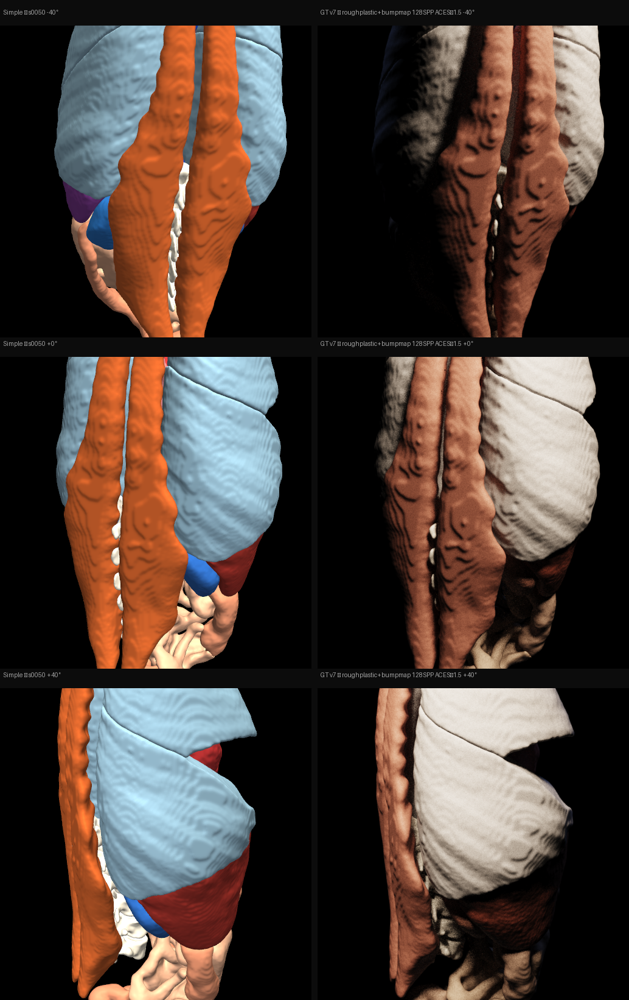

# GT Rendering Pipeline — Step by Step

From a raw CT scan to a photorealistic ground-truth image.  
Each step explains what we do, why, and what it produces.

---

## Step 0 — Input: Raw CT Scan


A CT scan is a 3D volume of **Hounsfield Unit (HU)** values — a physical measure of tissue density.
Air = −1000, water = 0, soft tissue = 20–80, bone = 400–1000.

The raw volume is grayscale and has no concept of "which tissue is which" — just density numbers.
We can't directly render photorealistic images from this because all soft tissue blends together.

---

## Step 1 — Segmentation Masks (TotalSegmentator)


**TotalSegmentator** (a pre-trained nnU-Net) automatically labels 117 anatomical structures in every CT.
Each structure gets its own binary mask: `liver.nii.gz`, `kidney_left.nii.gz`, etc.

This is the key enabler — now we know **exactly which voxels belong to which organ**.
Without this, all soft tissue looks the same in a CT and we can't assign per-organ materials.

---

## Step 2 — Mesh Extraction (Marching Cubes)


For each segmentation mask we run **Marching Cubes** at iso-value 0.5 to extract a 3D surface mesh.
A smoothing pass (30 iterations, relaxation=0.05) removes staircase voxel artifacts.

The result: one triangle mesh per organ, correctly positioned in mm-space, ready for a renderer.

> **Limitation at this stage:** the surfaces are **geometrically smooth** — no lobular liver texture,
> no cortical kidney columns, no muscle fiber ridges. Everything looks like polished plastic.
> This is the biggest aesthetic gap and what Step 5 addresses.

---

## Step 3 — Simple Render (Phong shading / input conditioning image)


The meshes are rendered with **PyVista + Phong shading** — one flat color per tissue,
two point lights, no global illumination. This takes < 1 second.

This is the **ControlNet input image** — fast, cheap, unambiguous.
It tells the model exactly where each organ is, what shape it has, and from which viewpoint.

> Colors are the standard anatomical atlas palette (orange muscles, blue kidneys, purple spleen)
> chosen for maximum visual distinctness, not anatomical accuracy.

---

## Step 4 — Material Assignment (roughplastic BSDF)

No image — this is a scene-setup step.

Each tissue is assigned a **roughplastic GGX BSDF** in Mitsuba 3:

| Tissue | IOR | GGX alpha | Diffuse color |
|--------|-----|-----------|---------------|
| Bone | 1.55 | 0.22 | cream `[0.90, 0.85, 0.77]` |
| Muscle | 1.40 | 0.45 | dark red-brown `[0.55, 0.24, 0.18]` |
| Liver | 1.40 | 0.35 | burgundy `[0.48, 0.15, 0.10]` |
| Aorta | 1.38 | 0.18 | bright red `[0.88, 0.12, 0.10]` |
| … | | | |

**roughplastic** = specular GGX lobe (sharp highlights from vessel/organ surface wetness)
+ Lambertian diffuse lobe (approximates the diffuse component of subsurface scatter).

> We tried: pure SSS with `roughdielectric + homogeneous medium` (v4) → organs went black.
> We tried: Disney principled BSDF (v3) → Mitsuba 3's principled has no SSS.
> roughplastic stays because its Lambertian layer implicitly handles opaque-tissue SSS and
> empirically looked best across all experiments.

---

## Step 5 — Procedural Bump Texture Generation

These are generated in Python (numpy + scipy) and saved as 512×512 PNGs.

| Texture | Used for | How generated |
|---------|----------|---------------|
|  **lobular** | liver, kidney, spleen, pancreas, gallbladder, heart | Dense Voronoi F1 (2000 seeds via scipy EDT) + 25% fractal noise. Bright cell bodies, dark cell boundaries → hepatic lobules, cortical columns |
|  **wrinkled** | stomach, small bowel, colon, duodenum | Coarser Voronoi (300 seeds) + 40% fractal noise → intestinal folds |
|  **fibrous** | muscles | Anisotropic Voronoi stretched 4× in Y → horizontal fiber striations |
|  **vessel** | aorta, IVC, portal vein | Elongated Voronoi stretched 4× in X → longitudinal vessel ridges |
|  **smooth** | lungs, bladder | 6-octave fractal noise + Gaussian blur → subtle fine texture |

These are loaded as **bump maps** (normal perturbation, not displacement) —
they shift surface normals per-pixel without changing geometry.
Bone gets no bump: cortical bone is actually smooth.

---

## Step 6 — UV Mapping

No image — another setup step.

Each organ mesh needs **UV coordinates** so the bump texture can be mapped onto it.
- **Sphere UV** (`texture_map_to_sphere`): liver, spleen, kidneys, gallbladder, heart, stomach, lungs
- **Plane UV** (`texture_map_to_plane`): muscles, esophagus, aorta, IVC, bowel

The UV OBJs are cached as `{organ}_uv.obj` so this only runs once per subject.

---

## Step 7 — Path Tracing (Mitsuba 3, GT render)


The scene is rendered with **Mitsuba 3** (`llvm_ad_rgb` variant, CPU path tracer):

- **Integrator:** `path`, max depth 48
- **Sampler:** `independent`, 128 SPP
- **Key light:** large warm area light `[82, 69, 56]`, scaled to scene size
- **Fill light:** large cool area light `[2.5, 3.4, 6.9]` from opposite side
- **Camera:** perspective, FOV 30°, positioned at `centroid + [0.6r, -1.1r, 0.5r]`
- **Bump map:** `bumpmap` plugin wraps each organ's roughplastic BSDF

Path tracing computes **global illumination**: soft shadows, inter-organ color bleeding,
realistic specular highlights, physically correct light falloff — all in one pass.

> Compare to simple render (Step 3): same geometry, completely different appearance.
> The bump map is now visible as surface texture on liver, kidney, bowel, and muscle.

---

## Step 8 — ACES Filmic Tonemapping


Path tracing outputs a **HDR image** (float32, values > 1.0 in bright areas).
Screens need an 8-bit LDR image.

We apply **ACES filmic tonemapping** at exposure ×1.5:
```
x = hdr * exposure
ldr = (x*(2.51x + 0.03)) / (x*(2.43x + 0.59) + 0.14)
```
- **Left:** raw linear HDR boosted for visibility — highlights clip, shadows black
- **Right:** ACES — S-curve preserves highlight detail + lifts shadows, cinematic look

---

## Step 9 — Final Output: Paired Training Image



Each subject produces a **grid of angle pairs** — simple (left) vs GT (right) at 3 camera angles.

This is the **ControlNet training sample**:
- Simple render = conditioning image (tells the model: shape + viewpoint)
- GT render = target image (tells the model: what it should output)

At training time the model learns: given a Phong-shaded anatomy image,
produce the corresponding path-traced photorealistic version.

---

## What's Still Missing vs Siemens Cinematic Rendering

| Gap | Status | Fix |
|-----|--------|-----|
| Surface micro-texture | ✅ Added (bump maps, Step 5) | Done |
| Per-organ material calibration | ⚠️ Approximate | Get Siemens LUT files from Simon |
| Sub-surface scattering | ⚠️ Approximated via roughplastic | True SSS needs scale trick + higher SPP |
| HDRI environment lighting | ❌ Missing | Add `.exr` environment map |
| High SPP (512+) for noise | ⚠️ Currently 128 | Run `--spp 512` for production |
| More subjects | ⚠️ Testing on 2 subjects | Batch over all 1228 after pipeline locked |
